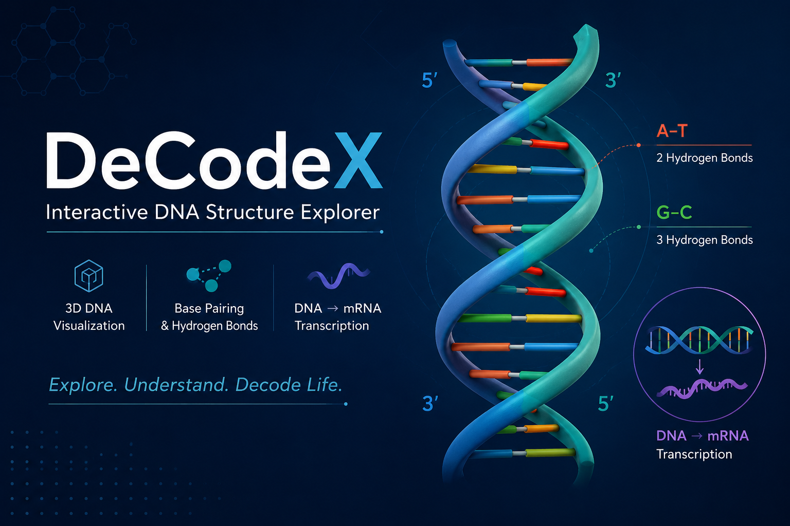

  

# 🧬 DeCodeX

### Interactive DNA Structure Explorer

Explore DNA architecture through an interactive B-form double helix, base pairing, and real-time transcription.

---

## 📖 Overview

**DeCodeX** is an open-source educational visualization of DNA structure. It enables learners to explore the B-form double helix, understand complementary base pairing, and visualize DNA-to-mRNA transcription through an interactive, browser-based experience.

---

## ✨ Features

- 🧬 Interactive 3D DNA helix
- 🔗 Hydrogen bond visualization
- 🧪 Base pair inspection (A–T & G–C)
- 🧬 Coding & template strand explorer
- ▶️ DNA → mRNA transcription animation
- 📱 Responsive, browser-based interface

---

## 📜 License

GNU General Public License v3.0 (GPL-3.0)

---

## 👨‍🏫 Author

**Draven-Ashcroft**

**DIPS Chain of Institutions, Tanda**

---

## 🙏 Acknowledgements

Developed with assistance from modern AI tools.

Special thanks to:

- **OpenAI (ChatGPT)** — scientific review, debugging, and implementation
- **Anthropic Claude** — implementation assistance and optimization
- **Google Gemini** — concept exploration and refinement
- **Moonshot AI** — debugging and prototype refinement
- **DeepSeek** — early drafts and experimentation

Inspired by **BioRender**, **NCERT Biology**, and modern scientific visualization principles.

---

## 🧬 DeCodeX

### *Unraveling the Blueprint of Life.*

