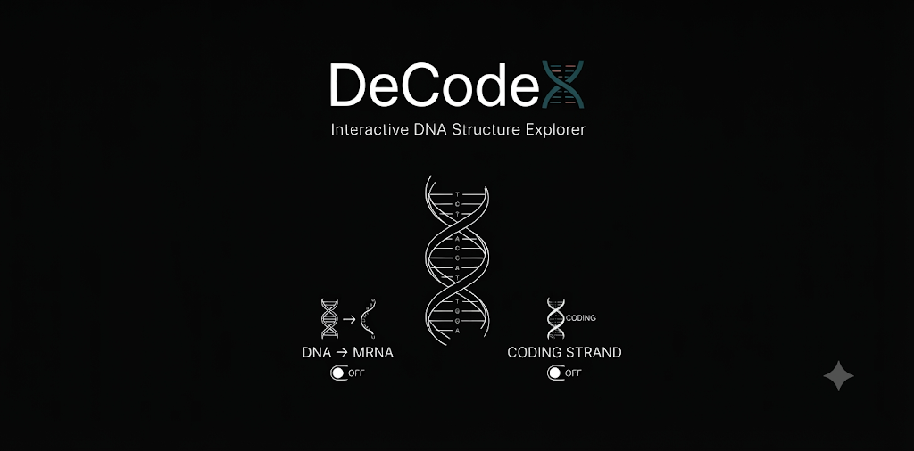

  

# 🧬 DeCodeX

**Interactive DNA Structure Explorer**

---

### 📖 Overview
**DeCodeX** is an open-source educational tool designed to demystify DNA architecture. Through an interactive B-form double helix, users can explore base pairing and witness the mechanics of molecular genetics.

### ✨ Features
*   **3D Helix Exploration**: Inspect the B-form double helix with real-time interactivity.
*   **Molecular Analysis**: Visualize hydrogen bonding and specific base pair (A–T, G–C) inspections.
*   **mRNA Mode**: Simulate and visualize the process of DNA-to-mRNA transcription.
*   **Coding Strand Toggle**: Switch between strands to enhance conceptual understanding of genetic encoding.
*   **Accessible Interface**: Fully responsive, browser-based design for classroom and self-study.

---

### 📜 License
GPL-3.0

### 👨‍🏫 Author
**Draven-Ashcroft** | DIPS Chain of Institutions, Tanda

---

### 🙏 Acknowledgements
Built with technical support from AI innovators: OpenAI, Anthropic, Google, Moonshot AI, and DeepSeek. Inspired by NCERT Biology and professional scientific visualization standards.
